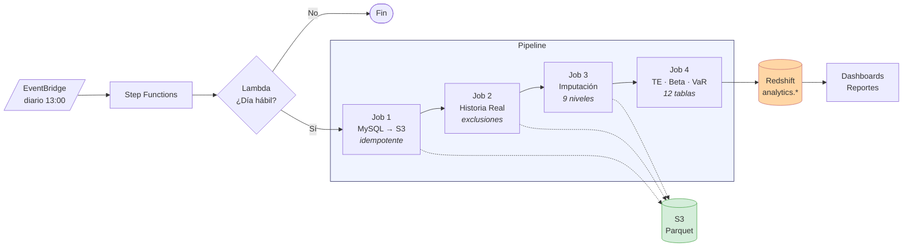

# Pipeline de Métricas de Riesgo — Tracking Error, VaR y Beta

Pipeline productivo que calcula diariamente **Tracking Error Ex-Ante, VaR 95% y Beta** para un fondo de pensiones regulado con 5 tipos de fondo y 2,000+ instrumentos financieros.

**Stack**: AWS Glue (PySpark) · Step Functions · S3 · Redshift · GitHub Actions (OIDC)

---

## Qué resuelve

Reemplaza un proceso manual de 4 horas en planillas por un pipeline automatizado de 15 minutos que se ejecuta diariamente después del cierre de mercado.

| Métrica | Definición | Variantes |
|---------|-----------|-----------|
| **Tracking Error** | Desviación estándar anualizada de la diferencia de retornos vs benchmark | Con/sin derivados |
| **VaR 95%** | Pérdida máxima esperada a 1 día (paramétrico, covarianza completa) | Con/sin derivados |
| **Beta** | Sensibilidad del portafolio respecto al benchmark | Ventana móvil 120 días |

---

## Arquitectura



**Decisiones de diseño clave:**
- **Staging idempotente** — Dynamic partition overwrite elimina duplicados en re-ejecuciones ([ADR-001](docs/adr/001-staging-idempotente.md))
- **Jerarquía de imputación 9 niveles** — Completa retornos faltantes del más específico al más general ([ADR-002](docs/adr/002-jerarquia-imputacion.md))
- **Normalización independiente de pesos** — Cada lado suma 1.0, evita distorsión por apalancamiento ([ADR-003](docs/adr/003-normalizacion-pesos.md))
- **Cap de retornos ±20%** — Winsorización limita impacto de outliers por denominadores pequeños
- **Pesos brutos para VaR** — Captura apalancamiento real de posiciones derivadas

---

## Resultados

| Fondo | TE (con deriv.) | TE (sin deriv.) | VaR 1d | Beta |
|-------|----------------|-----------------|--------|------|
| Agresivo | 0.92% | 1.72% | 0.90% | 0.36 |
| Moderado | 0.50% | 1.60% | 0.75% | 0.27 |
| Balanceado | 0.48% | 1.64% | 0.66% | 0.19 |
| Conservador+ | 0.53% | 1.33% | 0.63% | 0.20 |
| Conservador | 0.32% | 2.58% | 0.72% | 0.20 |

Los derivados reducen el tracking error entre 0.8–2.3% pero aumentan el VaR absoluto (apalancamiento implícito).

---

## Estructura del Proyecto

```
├── src/                     # Jobs PySpark (1:1 con Glue)
├── sql/ddl/                 # Definiciones de tablas Redshift
├── sql/validations/         # Queries de calidad de datos
├── infra/                   # Step Function + Terraform
├── .github/workflows/       # CI (lint) + CD (deploy vía OIDC)
├── docs/
│   ├── arquitectura.md      # Diagramas C4, flujo de datos, seguridad
│   ├── reglas_negocio.md    # Reglas de cálculo por clase de instrumento
│   ├── modelo_datos.md      # Modelo lógico/físico, volúmenes
│   └── adr/                 # Architecture Decision Records
└── caso_negocio.md          # Análisis ROI, modelo de costos
```

---

## Impacto de Negocio

| Métrica | Valor |
|---------|-------|
| Horas analista ahorradas | 1,100/año |
| Costo infraestructura | ~$250/mes |
| Período de payback | 4.6 meses |
| Tasa de éxito del pipeline | >99% |
| Latencia end-to-end | <30 min |

---

## Deploy

```
push a main → GitHub Actions → S3 → Glue (update-job)
```

- Autenticación OIDC (sin access keys estáticas)
- Detección de cambios: solo archivos modificados disparan deploy
- Preserva parámetros existentes del job durante actualización de scripts

---

## Documentación

| Documento | Contenido |
|-----------|-----------|
| [Arquitectura](docs/arquitectura.md) | Diagramas, flujo de datos, seguridad |
| [Reglas de Negocio](docs/reglas_negocio.md) | Fórmulas y reglas por clase de instrumento |
| [Modelo de Datos](docs/modelo_datos.md) | Tablas, vistas, volúmenes |
| [ADR-001](docs/adr/001-staging-idempotente.md) | Staging idempotente |
| [ADR-002](docs/adr/002-jerarquia-imputacion.md) | Jerarquía de imputación |
| [ADR-003](docs/adr/003-normalizacion-pesos.md) | Normalización de pesos |
| [Caso de Negocio](caso_negocio.md) | ROI, costos, impacto |

---

## Autora

**Daniela Chávez** — Data Architect · Cloud Data Platforms · Risk Analytics
